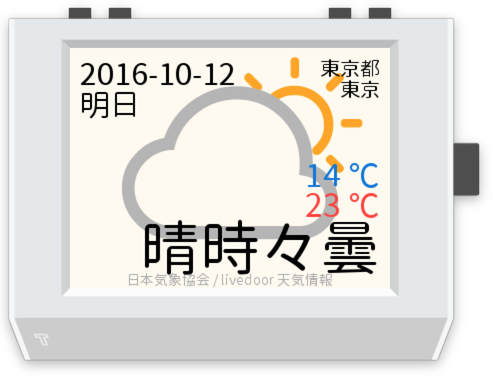

# Weather JP

This is a [tingbot](http://tingbot.com/) app. this app displays the weather forecast for Japan.



## Setting
You can set the city where you would like to know a weather forecast.

Create a settings.json with the following settings:

```json
{
    "city": ""
}
```

1. Visit [livedoor 天気情報](http://weather.livedoor.com/) and select the city.
2. Look the URL of the city page which you select. End number of the URL is city code.
3. Set the city code to `city` attribute of `settings.json`

### Example
URL of Osaka's forecast page is as folows.

> http://weather.livedoor.com/area/forecast/270000

Then, Osaka's city code is `270000`.
